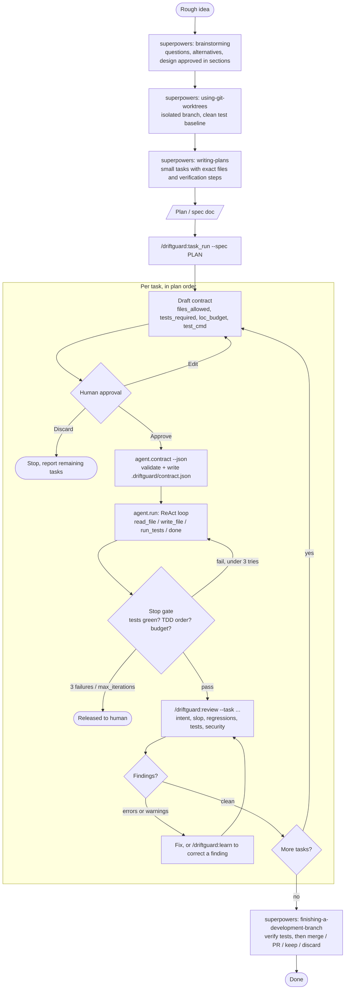
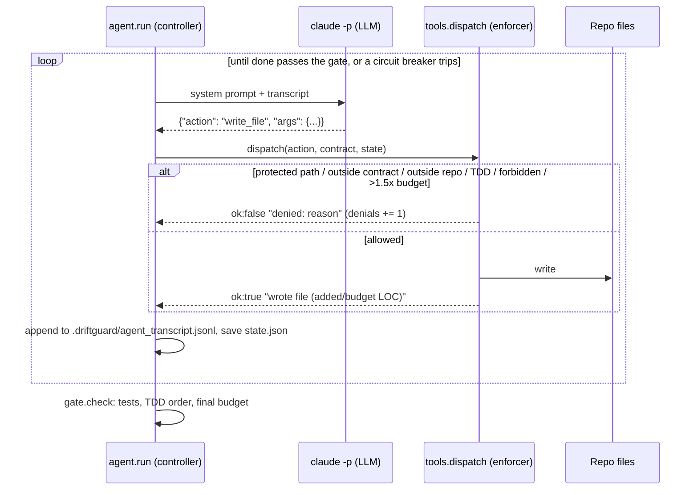
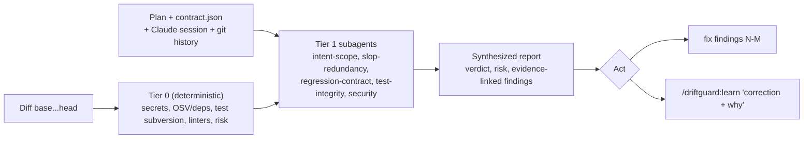

# Agentic coding end to end: superpowers → driftguard

This guide chains two Claude Code plugins into one flow from idea to merge:

| Stage | Plugin | Answers |
|---|---|---|
| **Design and plan** | [superpowers](https://github.com/obra/superpowers) | *What exactly are we building, and in which small steps?* |
| **Build under contract** | driftguard `/driftguard:task_run` | *Build one step, only inside the approved files, tests first, within budget.* |
| **Review against intent** | driftguard `/driftguard:review` | *Is this what was asked — and only that?* |
| **Finish** | superpowers `finishing-a-development-branch` | *Merge, open a PR, keep, or discard.* |

superpowers decides *what* to build. driftguard limits *how* the agent may build it,
then checks the result against the plan.

> **Two audiences.** Humans: read §1–§5. Agents: follow §0 exactly. It is the
> executable protocol, and the rest of the doc explains it.

---

## 0. Agent protocol (follow in order)

Load this file when a user asks to build a feature "end to end", "with superpowers
and driftguard", or points at this file. Each step has a **gate**. Do not move to the
next step until the gate holds. If a gate cannot hold, stop and tell the user.

| # | Do | Gate (must be true to continue) | On failure |
|---|---|---|---|
| 0 | Check tools: `command -v git python3 claude`; confirm skills `superpowers:brainstorming`, `superpowers:writing-plans`, and commands `/driftguard:task_run`, `/driftguard:review` are listed | All present | Show the §1 install commands for what's missing, then stop |
| 1 | Invoke `superpowers:brainstorming` with the user's idea | User approved the design | Keep iterating with the user; never assume approval |
| 2 | Invoke `superpowers:using-git-worktrees` | On a new branch, baseline tests pass | Report the failing baseline and stop |
| 3 | Invoke `superpowers:writing-plans` | A plan file exists and each task names its files and tests | Ask the user to refine the plan |
| 4 | Run `/driftguard:task_run "<feature>" --spec <plan path>` | Each task: contract approved, gate passed, review has no `error` findings | Stop at that task; report remaining tasks; don't hand-patch |
| 5 | For review findings: fix only what the user approves, then re-run `/driftguard:review` | No `error` findings; warnings fixed or accepted by the user | If the user says a finding is wrong: `/driftguard:learn "<correction + why>"` |
| 6 | Invoke `superpowers:finishing-a-development-branch` | User chose merge / PR / keep / discard | — |

Hard rules:
- **Never** use `superpowers:executing-plans` or `superpowers:subagent-driven-development`
  in this flow. `task_run` is the only execution path.
- **Never** write task code outside `agent.run`. Never edit `.driftguard/contract.json`
  or `state.json` by hand.
- **Never** approve a contract, design, or plan on the user's behalf.
- **Never** commit, push, or merge unless the user asks (step 6 asks).
- After each step, report to the user in one or two lines: the step, the gate result,
  and what comes next.

---

## 1. Install

Run these inside any Claude Code session.

### 1.1 superpowers

From the official marketplace:

```
/plugin install superpowers@claude-plugins-official
```

Or from the superpowers marketplace:

```
/plugin marketplace add obra/superpowers-marketplace
/plugin install superpowers@superpowers-marketplace
```

### 1.2 driftguard

```
/plugin marketplace add pparitoshh/driftguard
/plugin install driftguard@driftguard
```

### 1.3 Requirements

- `git`, `python3` 3.11+ (driftguard is stdlib only)
- `claude` CLI on `PATH` (the agent runner's backend calls `claude -p`)
- `gh` only if you review by PR number

Restart or reload Claude Code after installing so both plugins' skills and commands appear.

---

## 2. The whole flow



---

## 3. Stage by stage

### Stage A: design with superpowers

| Step | Skill | What you get |
|---|---|---|
| A1 | `brainstorming` | Clarifying questions, trade-offs, a design you approve section by section |
| A2 | `using-git-worktrees` | A new branch in an isolated worktree with a verified clean test baseline |
| A3 | `writing-plans` | A plan document: bite-sized tasks, each with exact file paths and verification steps |

Just describe the idea in the session. superpowers triggers these skills on its own,
or you can ask for them by name, e.g. *"use superpowers brainstorming for: add
subtract() to calc"*.

Keep the plan doc path; it is the input to the next stage.

> Skip superpowers' own execution skills (`executing-plans`,
> `subagent-driven-development`) for this flow. `/driftguard:task_run` replaces
> them with enforced execution: an allowlist, TDD order, a LOC budget, and a stop gate.
> superpowers' `test-driven-development` discipline is enforced mechanically by
> the contract's `tdd: true`.

### Stage B: build each task with `/driftguard:task_run`

```
/driftguard:task_run "add subtract() to calc" --spec docs/plans/<your-plan>.md
```

Options: `--repo PATH`, `--base B`, `--budget N`, `--no-review`.

Without `--spec`, `task_run` invokes superpowers `brainstorming` and then
`writing-plans` itself. If superpowers isn't installed, it writes
`.driftguard/spec.md` and asks you to approve it.

For each task in the plan:

1. **Contract drafted** from the task's files, tests, and acceptance criteria.
2. **You approve** it: Approve, Edit, or Discard. Nothing runs without Approve.
3. **Validated.** Paths must be repo-relative with no `..`, `{tests}` must be its
   own argument, the budget is at most 300 LOC, and test files must be in `files_allowed`.
4. **Agent loop** runs `claude -p`, which can only emit four actions:



5. **Stop gate.** Tests must pass, the test must be written before the implementation,
   and added LOC must stay under 1.5× the budget. A failure sends the agent back into
   the loop. After 3 failures, or at `max_iterations`, the task is released to a human.
   Gate failures are recorded as `[harness]` learnings.

Safety model:
- The agent has no shell tool.
- `test_cmd` is run without a shell.
- Writes are refused outside `files_allowed`, outside the repo (including via `..` or
  symlinks), and under `agent/`, `.driftguard/`, and `.claude/`.

### Stage C: review each task with `/driftguard:review`

`task_run` calls it automatically after a successful run. You can also run it by hand:

```
/driftguard:review --base main --task "task 3 from docs/plans/<your-plan>.md"
/driftguard:review 123          # once a PR exists
```



- `.driftguard/contract.json` is treated as the authoritative scope. Anything outside it
  is intent drift.
- Corrections recorded with `/driftguard:learn` go into `.driftguard/learnings.md` and
  apply to every future review.

### Stage D: finish with superpowers

Once every task has passed review, `finishing-a-development-branch` verifies the tests
and offers to merge, open a PR, keep the branch, or discard it. It also cleans up
the worktree.

---

## 4. Cheat sheet

```text
# once
/plugin install superpowers@claude-plugins-official
/plugin marketplace add pparitoshh/driftguard
/plugin install driftguard@driftguard

# per feature
"brainstorm: <idea>"                         -> superpowers:brainstorming
"set up a worktree"                          -> superpowers:using-git-worktrees
"write the plan"                             -> superpowers:writing-plans
/driftguard:task_run "<feature>" --spec <plan.md>   -> contract, run, review for each task
/driftguard:learn "<correction, with why>"   -> only when a finding was wrong
"finish the branch"                          -> superpowers:finishing-a-development-branch
```

## 5. Artifacts left behind

| Path | Written by | Purpose |
|---|---|---|
| plan doc (e.g. `docs/plans/*.md`) | superpowers `writing-plans` | The spec and task list; the review's intent source |
| `.driftguard/spec.md` | `task_run` (fallback only) | Spec when superpowers isn't installed |
| `.driftguard/contract.json` | `agent.contract` | Current task's enforced scope |
| `.driftguard/state.json` | `agent.run` | Iterations, denials, added LOC (lets a run resume) |
| `.driftguard/agent_transcript.jsonl` | `agent.run` | Every action and observation |
| `.driftguard/runs/<timestamp>/` | `/driftguard:review` | Review context and report |
| `.driftguard/learnings.md` | `/driftguard:learn`, gate | Persistent review memory |

Add `.driftguard/` to `.gitignore`, except `learnings.md` and `rules.md` if you want to
share them with your team.
